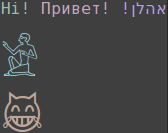
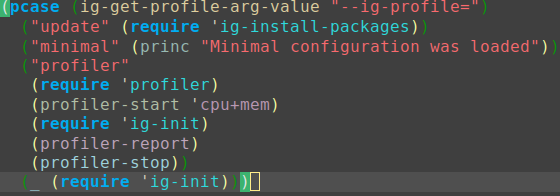

One more custom <a href=https://www.gnu.org/software/emacs>Emacs</a> config

<!-- markdown-toc start - Don't edit this section. Run M-x markdown-toc-generate-toc again -->
**Table of Contents**

- [Highlights](#highlights)
- [Installation and maintenance](#installation-and-maintenance)
    - [Clone](#clone)
    - [Update and install packages](#update-and-install-packages)
    - [Install fonts (optional)](#install-fonts-optional)
    - [Run](#run)
    - [Profile startup](#profile-startup)
    - [Debug init](#debug-init)
    - [Minimal config for testing](#minimal-config-for-testing)

<!-- markdown-toc end -->
# Highlights
1. Tested on [Arch Linux](https://www.archlinux.org) and [Cygwin](https://www.cygwin.com) with **Emacs 24.5** only

2. [Fonts support](lisp/ig-fonts.el) made easy per font/Unicode block/size

    

3. Fast initialization ([use-package](https://github.com/jwiegley/use-package) and more). **0.2 sec.** for `emacsclient`, **0.5 sec** for `emacs` with **SSD** on **Linux**, measured by `(emacs-init-time)`

4. All temporary files (history,session,tramp, etc.) in `volatile` directory

5. Custom command line arguments to use various runtime profiles. See [Makefile](Makefile) for example usage

6. Beautiful [alect themes](https://github.com/alezost/alect-themes), [rainbow-identifiers](https://github.com/Fanael/rainbow-identifiers), [rainbow-delimiters](https://github.com/Fanael/rainbow-delimiters), [spaceline](https://github.com/TheBB/spaceline)

    

# Installation and maintenance
## Clone

    git clone https://github.com/igorepst/igemacs

## Update and install packages
`make up` - this is to separate packages maintenance from their usage

## Install fonts (optional)
* [DejaVu Sans Mono](http://sourceforge.net/projects/dejavu/files/dejavu/2.35/dejavu-fonts-ttf-2.35.tar.bz2)
* [Symbola](http://users.teilar.gr/~g1951d/Symbola.zip)
* [Noto Sans Symbols](https://github.com/googlei18n/noto-fonts/blob/master/unhinted/NotoSansSymbols-Regular.ttf?raw=true)
* [Noto Sans Egyptian Hieroglyphs](https://github.com/googlei18n/noto-fonts/blob/master/unhinted/NotoSansEgyptianHieroglyphs-Regular.ttf?raw=true)

## Run
* if cloned to .emacs.d: `emacs` or `emacsclient`

* if cloned to another directory: `make run`

## Profile startup

    make profile

## Debug init

	make debug

## Minimal config for testing

	make min

